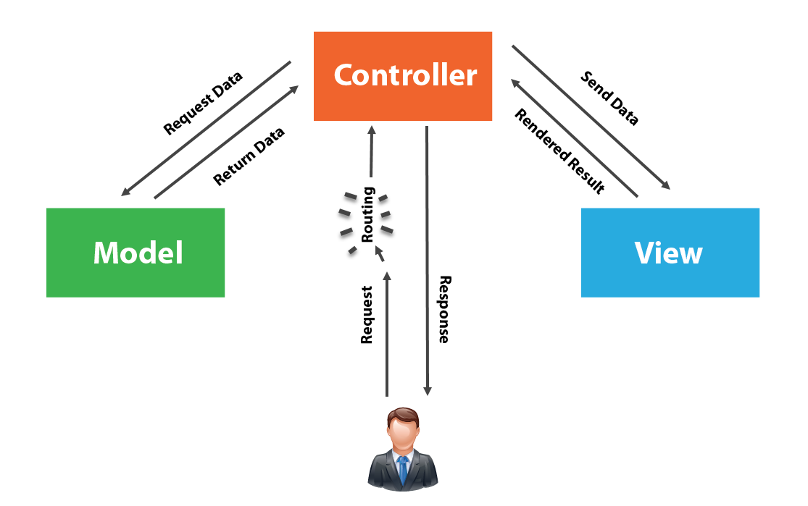

MVC Lecture 

What the heck does MVC stand for ? 

M - Model - defines data structure (Request data, Returns data)
    // eg.) updates app to reflect added item 

v - View - Defines the display (UI) 
    //  eg.) user clicks 'add to cart'

C - Controller - Contains control logic
    // eg.) recieves updates from view , notifies model to 'add item'

How it works ?

A user requests a page from a server (Client). 
The server sends the request information to a controller. 
The controller asks the model for information based on the request. 
The model interacts with the database (Mongoose) can be used to get the information and sends it back to the controller. 
The controller tells the view to display the information. 
The view renders the final page based on the data in the model.

